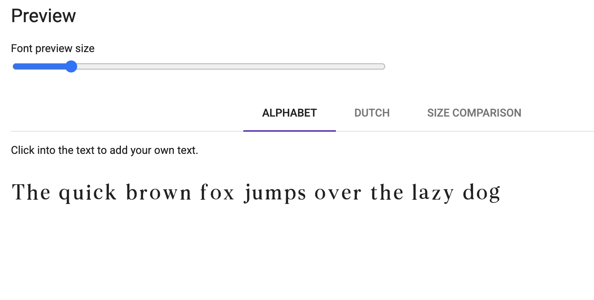
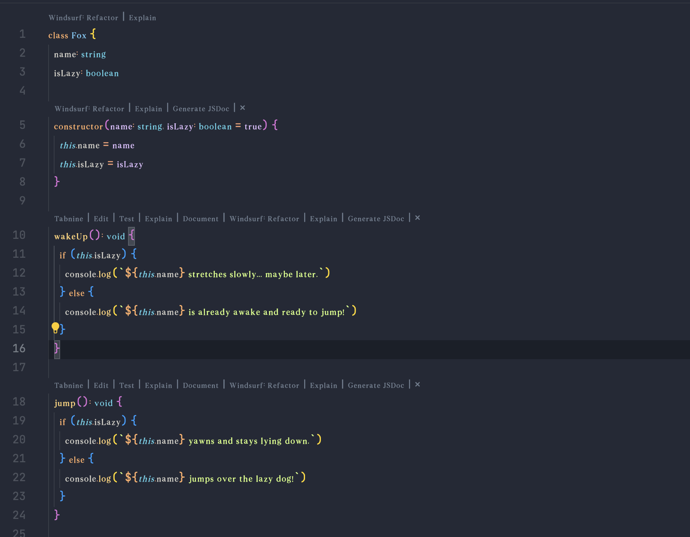
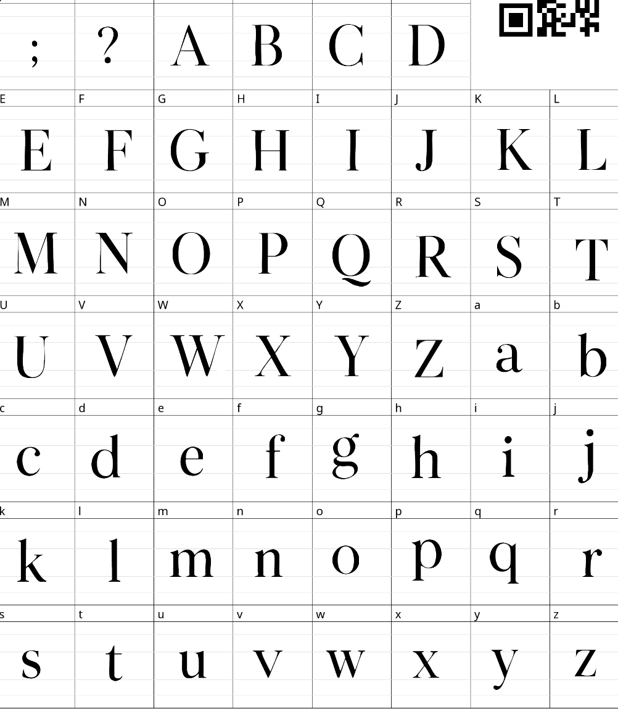
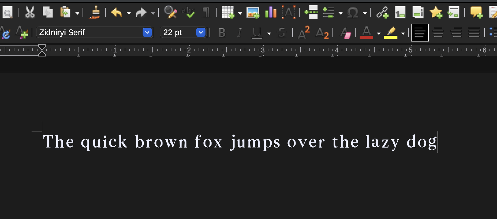

# Zidniryi Serif

**Zidniryi Serif** is a high-contrast, elegant serif typeface inspired by timeless editorial fonts like Didot and Bodoni. It features refined strokes, luxurious curves, and a minimalist sophistication ideal for branding, headlines, magazines, and creative projects.

## ✨ Features

- Full uppercase and lowercase alphabet (A–Z, a–z)
- Numerals (0–9)
- Extended punctuation and special characters:
  `! @ # $ % ^ & * ( ) _ + - = { } [ ] | \ : ; " ' < > , . ? / ~`
- High-contrast thick and thin strokes
- Classic serif details with a modern twist
- Designed for display and editorial use

## 📁 Files Included

- `ZidniryiSerif-Regular.ttf`
- `ZidniryiSerif-Regular.otf`
- Poster preview images (`/previews` folder)
- `LICENSE` file (MIT License)

## 🔤 Preview



### Code Editor


###  Layout


###  Libreoffice



## 📐 Usage

You can use **Zidniryi Serif** in:

- Editorial layouts
- Fashion branding
- Minimalist web headers
- Luxury packaging
- Quotes and typographic posters

## 📦 Installation

To use the font locally:

## 📄 License

Zidniryi Serif is licensed under the MIT License, which means you can:

- Use it freely in personal and commercial projects
- Modify and adapt it to your needs
- Distribute it with your projects

See the `LICENSE` file for the full license text.

```bash
# Move to fonts folder or system-wide directory
cp ZidniryiSerif-Regular.ttf ~/Library/Fonts/
